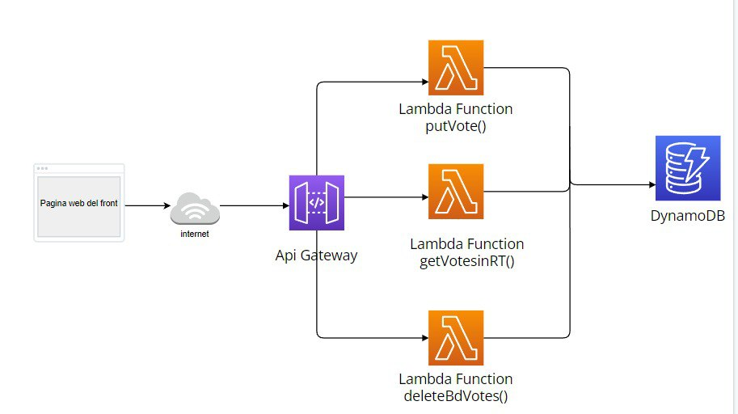

# Sistema de Votación

Este es un proyecto de sistema de votación que permite a los usuarios votar por diferentes candidatos y ver los resultados en tiempo real.

## Integrantes del equipo

- Carlos Ernesto Camargo León ([charlie2913](https://github.com/charlie2913))
- Geraldine Nicole Ibieta García ([nini1304](https://github.com/nini1304))

## Tecnologías utilizadas

- Frontend: HTML, CSS, JavaScript
- Backend: AWS Lambda, AWS API Gateway, AWS DynamoDB
- Serverless Framework

## Estructura del proyecto


Los componentes vistos en el diagrama son los siguientes:
-Pagina web Front
-Internet
-Api Gateway
-Lambda
-DynamoDB

El proyecto consta de dos partes principales: el frontend y el backend.

### Frontend

El frontend del sistema de votación se encuentra en la carpeta `frontend` y está compuesto por los siguientes archivos:

- `index.html`: Contiene la estructura HTML de la página de votación.
- `styles.css`: Archivo CSS que define los estilos visuales de la página.
- `main.js`: Archivo JavaScript que maneja la interacción con el usuario y las solicitudes HTTP a la API.

### Backend

El backend del sistema de votación utiliza servicios de AWS y se encuentra configurado utilizando el Serverless Framework.

- `serverless.yml`: Archivo de configuración del Serverless Framework que define las funciones Lambda, las rutas de la API y los permisos de acceso.
- `handler.js`: Archivo que contiene las funciones Lambda que manejan las operaciones de votación y obtención de votos.

## Requisitos

Antes de utilizar este proyecto, asegúrate de tener instalado lo siguiente:

- Cuenta de AWS: Debes tener una cuenta de AWS para desplegar la aplicación en AWS Lambda y utilizar los servicios de AWS.
- Node.js: [Descargar Node.js](https://nodejs.org)
- NPM: NPM se instala automáticamente con Node.js
- Serverless Framework: Ejecuta el siguiente comando para instalarlo de forma global:
  ```
  npm install -g serverless
  ```

## Configuración y despliegue

Para configurar y desplegar el proyecto, sigue los siguientes pasos:

1. Clona el repositorio en tu entorno local.
2. Entra en la carpeta `frontend` y modifica los archivos HTML, CSS y JavaScript según tus necesidades.
3. Entra en la carpeta `backend` y modifica el archivo `serverless.yml` para ajustar la configuración de AWS, como el nombre de la tabla de DynamoDB, las políticas de IAM, etc.
4. Configura tus credenciales de AWS: Puedes utilizar [AWS CLI](https://aws.amazon.com/cli/) o crear un archivo `~/.aws/credentials` con tus credenciales de acceso.
5. Asegúrate de tener instalado Node.js y el Serverless Framework en tu entorno.
6. Ejecuta el siguiente comando en la terminal para desplegar el backend en AWS:

   ```bash
   serverless deploy
   ```

6. Una vez desplegado el backend, obtendrás las URL de las API creadas.
7. Actualiza las URLs en el archivo `main.js` del frontend para que apunten a las rutas correctas.
8. Abre el archivo `index.html` en un navegador y podrás comenzar a utilizar el sistema de votación.

## Uso

Una vez desplegado y configurado el proyecto, puedes utilizar el sistema de votación de la siguiente manera:

1. Accede a la página de votación a través de la URL proporcionada.
2. Elige un candidato seleccionando la opción correspondiente.
3. Haz clic en el botón "Votar" para enviar tu voto.
4. Los resultados de los votos se mostrarán automáticamente en la sección correspondiente de la página, actualizándose cada 5 segundos.
5. Puedes utilizar el botón "Borrar registros" para eliminar todos los registros de votos almacenados en la tabla de DynamoDB.


